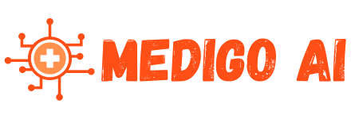
# MediGo AI Dashboard

Medigo AI is an AI-powered medical dashboard designed to enhance healthcare for doctors and general users. 
It combines state-of-the-art AI models with telemedicine, MedTech integrations, and mental health tools, 
creating a comprehensive and user-friendly solution. This project is divided into two sections: 
*Doctor* and *General User*, catering to their specific needs.

---
## Project live deploy url = https://medigoai.vercel.app/

### Test all ML Model at = https://medigoai.vercel.app/Dashboard/ml-model-test

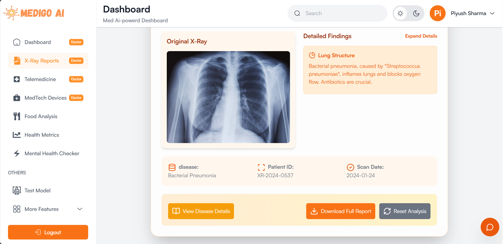

### Video Demo 
- demo Video [Link](https://youtu.be/or7UiNdHYqM?si=gbNUS4hovgVTKJeY)

 [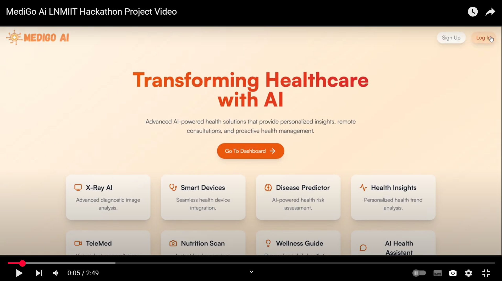](https://youtu.be/or7UiNdHYqM?si=gbNUS4hovgVTKJeY)

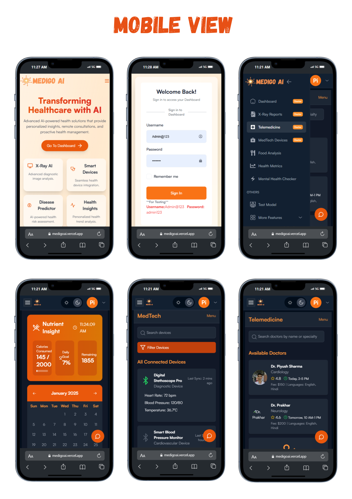

---

## Features

### Doctor Section
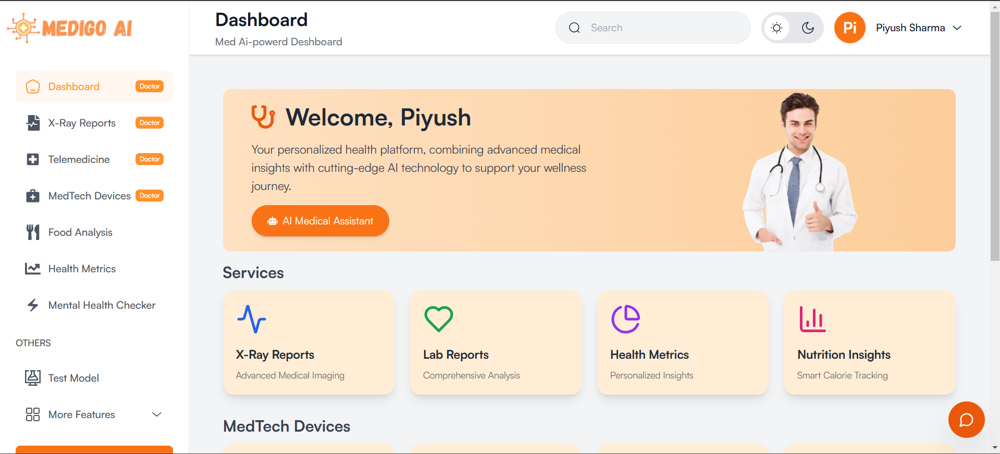
1. *AI Disease Detection*
   - *Chest X-Ray Analysis*: Detects diseases such as:
     - Bacterial Pneumonia
     - Coronavirus Disease
     - Tuberculosis
     - Viral Pneumonia
     - Normal
   - *Brain X-Ray Analysis*: Detects diseases such as:
     - Glioma
     - Meningioma
     - No Tumor
     - Pituitary
   - *Output*:
     - Disease Name
     - Summary
     - Possible Causes
     - Risk Factors
     - Symptoms
     - Home Remedies
     - Complications
     - When to See a Doctor
     - Whom to Consult
     - Calorie and Diet Recommendations
   - *Future Scope*: AI-powered image annotation to highlight disease areas in X-rays for better analysis.

2. *Telemedicine*
   - Connect doctors and patients through:
     - Chat
     - Video Calls
   - Enables remote consultations and healthcare delivery.

3. *MedTech Device Integration*
   - Supports integration with smart medical devices:
     - Digital Stethoscope
     - Smart Blood Pressure Monitor
     - Portable ECG Tracker
   - Features:
     - Digital result visualization.
     - Automatic data storage for analysis and record-keeping.

---

### General User Section
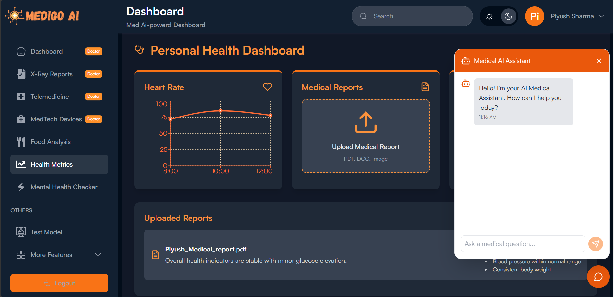
1. *Medigo AI Agent Chatbot*
   - Users can:
     - Ask health-related questions.
     - Upload X-ray images to get disease predictions and reports.
     - Receive a JSON-based report with comprehensive details (same as doctor output).

2. *Diet Analysis AI*
   - Users can upload images of their meals to:
     - Get nutritional insights.
     - Understand the caloric and nutrient composition of their food.

3. *Mental Health Checker*
   - Allows users to take assessments to:
     - Analyze mental health traits.
     - Receive recommendations for improvement.

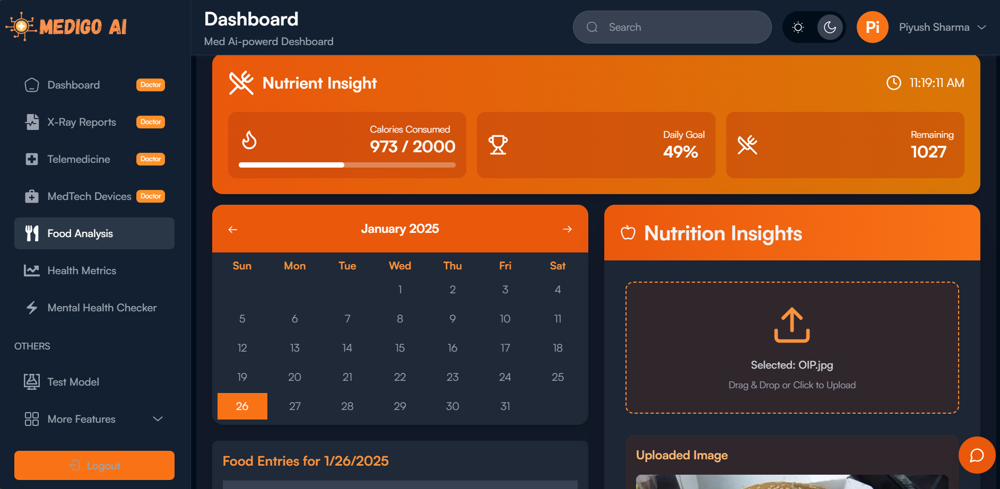
---
## Model Releted 
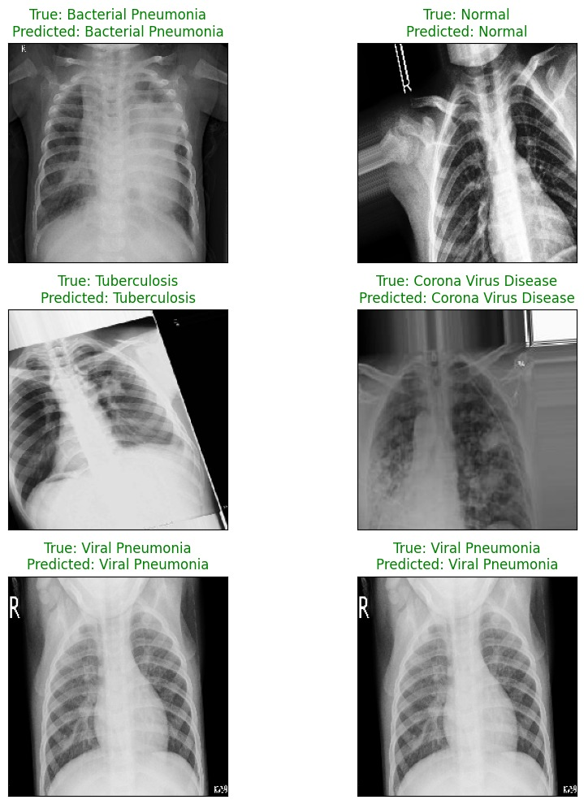
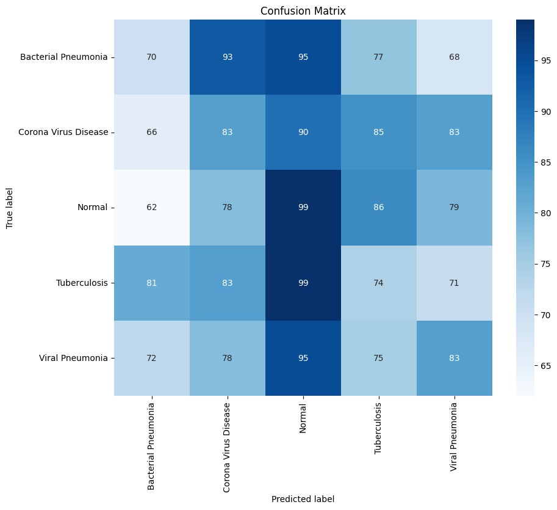
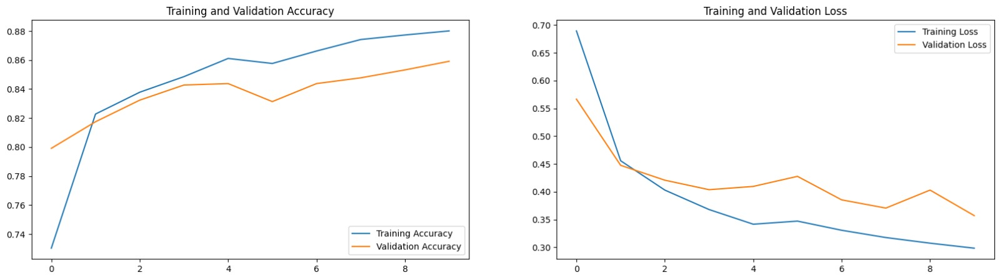
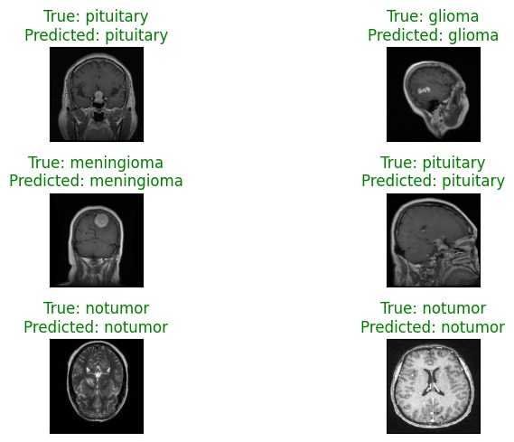

---

## Project Architecture
#### System Flowcharts 
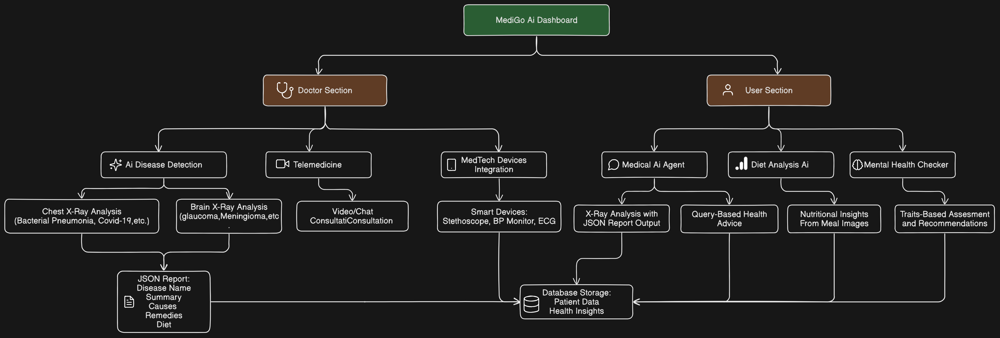

### 1. AI Models
   - Chest X-Ray Disease Detection
   - Brain X-Ray Disease Detection
   - Diet Analysis Model
   - Mental Health Assessment Model

### 2. Data Flow
   - Input: X-rays, Images, and Queries.
   - Processing: AI models analyze input data and generate outputs.
   - Output: JSON-based reports with disease details, insights, and recommendations.

### 3. Database
   - Stores:
     - Patient data
     - Medical records
     - X-ray analysis results
     - Chat and video call logs
   - Ensures data security and compliance with regulations (e.g., HIPAA, GDPR).

### 4. User Interface
   - Doctor Dashboard: For accessing patient records, reports, telemedicine, and device data.
   - User Dashboard: For chatbot queries, X-ray uploads, diet analysis, and mental health assessments.

   

---

## Future Enhancements
- Implement AI-powered annotation for X-rays to highlight diseases.
- Expand disease detection to other areas (e.g., cardiology).
- Add multilingual support for global accessibility.
- Integrate wearable devices (e.g., fitness trackers).

---

## Contact
For queries or contributions, contact us at:
Contact No : 9460994274 (Piyush Sharma ), 6367941411 (Siddhant Khandelwal)
